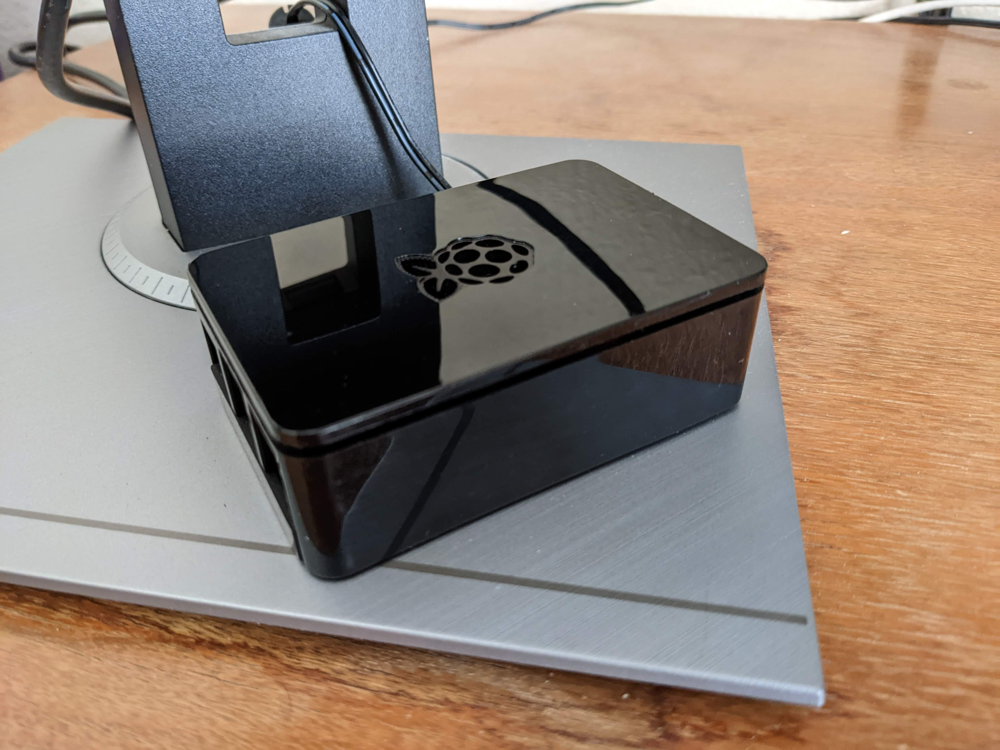

Even though I've used Discord as a platform for many years, and been interested in possibly creating a bot, I never did properly look into it. But recently, that changed when one of my [most-used bots](https://github.com/stoir/passel_public/), Passel, was announced to be discontinued. I discovered that one of the users of the bot had created a [fork](https://github.com/somedumbfox/passel-js) called `passel-js` using Discord.js, and being more familiar with JavaScript than Python, I decided to go for it.

The first important thing I learned about how Discord bots work is that they only serve as an interface with the Discord API. This means that there's no port-forwarding necessary when trying to host one; all you need is the process to be running constantly, and the bot will work fine. Knowing that, and also knowing that this bot would only be hosted on one server (and therefore not very resource-intensive), I elected to skip on paying DigitalOcean to host the bot and used my Raspberry Pi 3B instead.

## Forking `passel-js`

After running `passel-js` and seeing that it was attempting to be a one-to-one copy of `passel_public` rather than adding any new features, I forked the repo and made my own bot with some modifications. I called it [`pinsir`](https://github.com/laforcem/pinsir), with added support for the `dotenv` Node module and a few changes to embeds.
